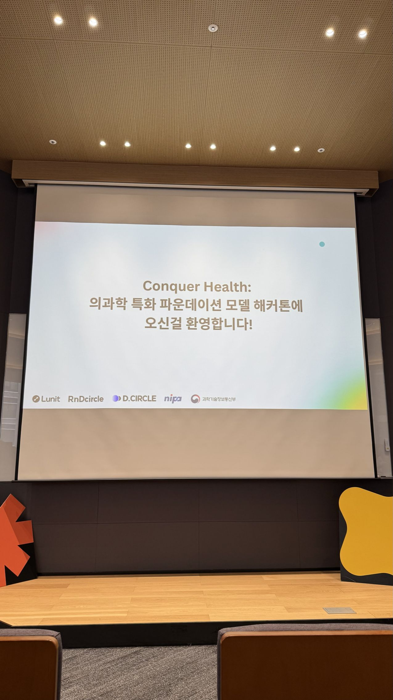
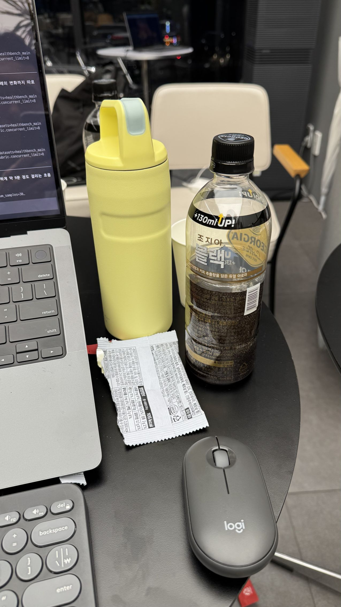
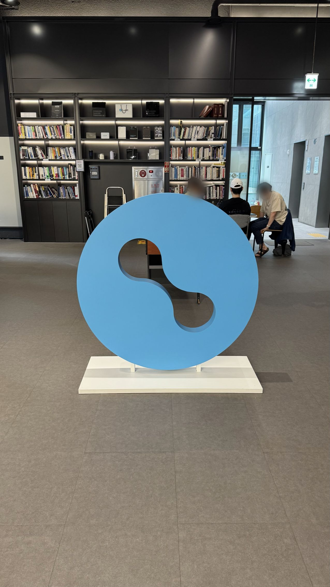

2026년 8월 21일 부터 22일까지 루닛 오피스에서 열린 '의과학 특화 파운데이션 모델 해커톤'에 참가 하였다. 이 글은 그 후기와 그 과정에서 배운 것들을 정리 해 보고자 작성 했다.

일단 해커톤 자체에 대해서 간단히 이야기 하자면 다음과 같다. [루닛](https://www.lunit.io/ko/)은 '인공지능기술로 암을 정복한다'는 미션 아래에서 의료 인공지능 만드는 회사이다. 지금까지는 주로 이미지/영상 기반 시스템을 만들어 왔다면 새롭게 LLM 및 관련 서비스를 만들고 있다. 루닛에서는 L2라는 LLM 모델을 만들었는데 이 모델은 의료지식에 특화 되어 있는 언어 모델이다. 이 모델을 활용해서 의료 기반 채팅 시스템을 만드는 것이 해커톤의 목표였다. 평가는 [HealthBench](https://openai.com/index/healthbench/)라는 벤치마크 점수와 의료 기반 채팅의 퀄리티를 주관적으로 평가 하는 방식으로 이루어졌다. 이 두 영역에서 각각 1등에게 상을 수여 하였다.

이 글에서는 해커톤에서 일어난 일들이나 행사 자체에 대한 이야기를 하기 보다는, 내가 어떻게 접근했고 그게 왜 패착으로 이어졌는지를 이야기 한다. 작은 LLM을 가지고 하네스를 만드는 것에 관심이 있다면 약간은 도움이 될 수 있을 것 같다.

먼저 강조하고 싶은게 있는데 이 글은 **나에 대한 이야기**이지 우리팀에 대한 이야기가 아니다. 패착도 나의 패착이지 팀의 패착이 아니다. 나는 팀 없이 참가를 해서 현장에서 팀을 구성 했는데 우리 팀은 정말 결과가 좋았다. 우리 팀은 벤치마크 평가에서 2위를 했는데 1위와 간발의 차였다고 한다. 채팅 퀄리티 평가는 순위가 나오지는 않았지만 우리팀의 결과가 좋았다고 들었다. 이런 해커톤의 특성상 팀 내에서 각자가 여러가지 시도들을 하면서 progress가 생기면 공유하고 적용하는 식으로 진행을 하는데, 그 과정에서 내가 팀에 별 다른 도움이 되지 못했다. 우리 팀의 좋은 결과는 팀원분들의 공이 크다.

해커톤이 끝나고 뒤돌아 생각해보니 해커톤 내내 내가 완전히 방향을 잘못 잡았었다는 것을 깨달았다. 해커톤 중간에 그걸 알 수도 있었는데 왜 그때는 생각을 못했는지... 나 스스로 너무 답답해서 1위한 팀에게도 가서 어떤 식으로 접근 했고 문제를 풀었는지 물어봤다. 그러고 나니 내가 무엇을 잘못 생각 했는지 더 명확해졌다.

## 내가 한 것

루닛의 LLM의 이름은 L2인데, L2를 가지고 정말 기본적인 채팅이 가능하도록 연결해서 제출을 해보니 40 후반대의 점수가 나왔고 그 당시 리더보드에서 1위를 했었다. 나는 그래서 더 얻을 수 있는 점수가 많을 것이라고 생각했다. 별 다른 것 없이 해서 제출 했는데 거의 50점이면 아무래도 70은 갈 수 있지 않을까 생각 했다. 하지만 그게 문제의 시작이었다.

무엇이 문제였는지는 뒤에서 이야기 해보자. 어쨌든 이 생각을 가지고 나는 '시스템'을 만들려고 했다. 즉, 파이프라인을 어떻게 구성 하느냐에 따라서 결과가 다르게 나올 것이라고 생각 한 것이다. 그래서 처음에는 '의사-환자' 에이전트를 구성해서 쿼리가 들어오면 환자 에이전트가 질문을 구체화 하고 의사가 답변을 하면 환자가 리뷰를 해서 만족스럽지 못하면 다시 의사에게 쿼리를 하는 방식이었다. 이 방법은 바로 기각 되었는데 속도가 너무 느렸다. LLM은 느리고 벤치마크의 질문 수는 많았다는 것을 간과했다. LLM이 느린것이 해커톤 내내 너무 힘들었다. 테스트 한번 돌리는데 몇 십분이 걸리니 다양한 시도를 하기 어려웠다. 근데 이것은 비단 해커톤에서만 발생 하는 것은 아니다. 실제로 LLM기반 시스템을 만들다 보면 쉽게 발생하는 문제다.

그 다음부터 나는 계속 파이프라인을 바꾸는 시도를 했다. 쿼리를 기반으로 3개 정도의 페르소나를 만들고 각 페르소나에 대해서 진단을 한 후에 답변을 합치는 것도 시도 해보고, 쿼리에서 키워드를 많이 뽑아서 그것들로 관련 자료를 검색 한 후에 답변을 생성하는 방식도 해보았다. 의사처럼 쿼리를 기반으로 차트를 작성 하게도 해 보았다. 근데 하나도 동작을 하지 않았다. 해커톤 내내 이렇게 거시적인 수준에서만 접근했고 프롬프트를 세부적으로 고치는 방식으로는 하지 않았다.

## 나의 실수

첫 번째 실수는 파이프라인 구조를 만드는데 집착했다는 것이다. 내가 시도한 대부분의 방법들의 공통점은 파이프라인에 어떤 에이전트를 만들고, 각 에이전트의 입출력 종류를 바꾸면 성능이 나아질 것이라는 가설 위에서 만들어졌다. 이건 아무래도 나의 습성 때문인 것 같다. 나는 문제에 접근할 때 탑-다운 방식으로 많이 생각한다. 그러다보니 구조에 대한 설계부터 시작했고 이 생각을 너무 오래 했다. 그리고 그 바탕에는 큰 점수의 차이는 구조의 차이가 만들어 낼 거라는 생각이 있었다. 보통의 소프트웨어는 그럴 수 있지만 LLM 하네스는 그렇지 않았다.

두 번째 실수는 L2가 무엇을 못하는지 파악을 제대로 하지 않았다는 것이다. 정확히는 L2의 문제점을 파악하려고 시도를 했지만 미시적으로 보지 않고 대략적인 통계만 보면서 문제를 해결 하려 했다. 예를 들어서 벤치마크를 돌려보면 현재 모델이 어떤 대답을 잘 못하는지 통계를 볼 수 있다. 그 거시적인 지표들과 거기에서 AI가 추천해 주는 솔루션들을 적용 하면서 개선을 해 나갔는데 무용지물이었다. **이게 바로 AI로 '딸깍' 만드는게 왜 안되는지 알 수 있는 사례이다.**

해커톤에서 좋은 솔루션들을 어떻게 찾았는지 들어보면 디테일하게 사례들을 보고 케이스들을 파악해서 핀셋처럼 정확하게 그러한 케이스들에서 어떻게 동작 하도록 프롬프트를 만드는 방식이었다. 그렇게만 해도 정확도가 많이 올라갔다. 결론적으로 보면 우리 팀의 최종 결과물도 그렇고 1위 팀의 결과물도 파이프라인이 복잡하지 않다. 굉장히 단순한데 프롬프트를 어떻게 짜느냐가 퍼포먼스를 크게 결정했다. 그리고 그런 프롬프트는 거시적인 결과들만 보고서는 만들기가 어려웠던것 같다. 우리팀의 경우에는 '플레이북'을 만들어서 LLM의 행동을 가이드 했고, 1위 팀의 경우 LLM이 자주 하는 실수들을 파악해서 무엇을 하지 않도록 가이드를 주는 프롬프트를 많이 넣었다.

사실 나는 몇 가지의 케이스를 보고 하네스를 만드는 것을 경계 했었다. 방대한 데이터에 비해서 너무 특수한 사례를 보고 구현을 하는 것이라 생각 했기 때문이다. 또한 그렇게 해봐야 커다란 점수 변화를 만들지 못할 것이라 생각 했다. 그래서 이 방향으로는 생각을 잘 안 했었다. 하지만 지금 돌아보면 너무 거시적인 것들만 보고 방향을 설정 하는 것 역시 효과적이지 못했다. 오히려 몇 가지 케이스들을 보여주면서 LLM에게 하네스를 만들라고 하면, LLM이 알아서 적당히 일반화를 할 테니 내가 걱정 하던 문제도 해결 될 것 같다.

## 결론

이번 해커톤을 하면서 배운 것들은 다음과 같다.

- 거시적인 구조를 설계하는 것으로는 큰 개선이 어렵다. 하나의 task 안에서라면 에이전트를 어떻게 연결하는지는 그리 중요하지 않은 것 같다.
- LLM이 무엇을 못하는지 디테일한 사례들을 보고 분석 하는 것은 중요하다.
- 하네스를 설계 할때는 LLM이 못하는 것을 하게 하자는 것보다, 하지 말아야 할 것을 안하게 하자는 방향성이 더 효과적인것 같다.

## 기타

해커톤에 참가 한 이유는 많이 배우고 싶어서였다. LLM 시대에 기존에 내가 가지고 있던 지식들은 많이 무용지물이 된 것 같다는 생각을 했고, 다양한 곳에서 많이 배우지 않으면 안되겠다는 생각을 했다. 그래서 요새 왠만한 LLM 관련 행사들은 참가 해 보려고 한다. 이번 해커톤은 정말 좋은 기회였고 팀원 분들을 비롯하여 같이 해커톤에 참가하신 분들, 그리고 해커톤을 조직해주신 분들에게 감사를 전하고 싶다.

원래 밤을 샐 생각이 없었다. 적당히 하다가 오고 싶었는데 막상 리더보드에 점수가 찍히는걸 보니 승부욕이 생겼고, 나의 퍼포먼스에 실망도 해서 어쩌다보니 밤을 샜다. 오랜만에 논문쓴다고 밤새고, 과제한다고 밤새던때 생각이 났다.

